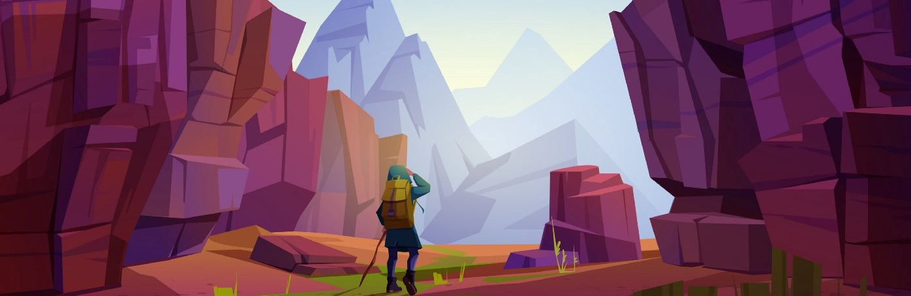

  

### 🙋‍♂️ Who am I? How did I end up here?
  - I'm **Raphael Laranjeiras** and I'm **28**. I'm from Salvador, Bahia, Brazil. **Graduated** in **Civil Engineering** in 2017. I never had any 
solid experience in the field of engineering. In fact, the only job experience I had was as a trainee in the company Saam Smit Towage. A company 
not related to Civil Engineering. I used to be an administrative assistant without many attributions. I worked there for about 7 months. After that, 
I studied and applied to work as an administrative assistant for Federal Public Ministry and as a supply chain analyst for Petrobrás (a Brazilian 
government oil company). I wasn't selected for both of them (yet). Since May I've finally **discovered what**  makes me happy and **fuels me**: 
Data Science, Machine Learning, DataViz.  🤖📊

### 😍  What am I passionate about?
  - Data (you weren't expecting that.. 🙃)
  - Solving business problems 📈
  - Finding hidden patterns 🔍
  - "Predicting" the future and creating something new 🤖
  - Other than work-related:
    - Family 👪
    - Pets (especially my two cats) 🐾
    - Movies, TV-Shows (almost a cinephile..) 🎬
    - Soccer (It's football, ok? haha) ⚽
    - Playing games (I used to play more..) 🎲
    - Learning something new, preferably something unusual, different, curious, interesting. 🤓
    
   
### 🤝  Job Status
  - I’m currently **unemployed** and self-learning data science and its related topics. Looking forward to my **first job opportunity**.

### 🖥️  Portfolio
  - All the **personal projects** I've been creating here are shared with their comments and insights when necessary. 
  - The projects are written in **Portuguese (pt-br) or English**. It depends on the project.  
  - Sometimes I also write on **Medium** about theoric topics in the Data Science universe. Feel free to check it out.
  - In general, **feel free to contribute**: improvements, corrections, anything will be very welcomed.

### 🤹 Skills

  - **Hard**: 
  
     

  - **Soft**:
    - Observant
    - Detalist
    - Curious 
    - Committed
    - Careful 
---

